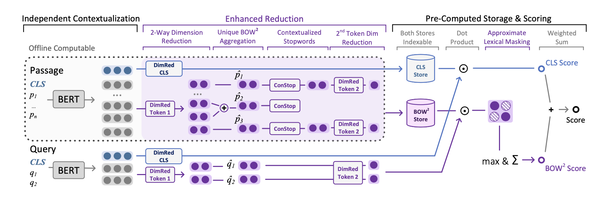

# **ColBERTer:** Contextualized Late Interactions using Enhanced Reduction

*Introducing Neural Bag of Whole-Words with ColBERTer: Contextualized Late Interactions using Enhanced Reduction* Sebastian Hofstätter, Omar Khattab, Sophia Althammer, Mete Sertkan, Allan Hanbury

https://arxiv.org/abs/2203.13088

**tl;dr**  ColBERTer is a neural retrieval model using contextualized late interaction (ColBERT) with enhanced reduction. ColBERTer fuses single-vector retrieval, multi-vector refinement, and optional lexical matching components into one model. For its multi-vector component, ColBERTer reduces the number of stored vectors per document by learning unique whole-word representations for the terms in each document and learning to identify and remove word representations that are not essential to effective scoring.

If you have any questions, suggestions, or want to collaborate please don't hesitate to get in contact with us via [Twitter](https://twitter.com/s_hofstaetter) or mail to s.hofstaetter@tuwien.ac.at


*The high-level overview of the architecture of ColBERTer*

**Please cite our work as:**
````
@article{Hofstaetter2022_colberter,
 author = {Sebastian Hofst{\"a}tter and Omar Khattab and Sophia Althammer and Mete Sertkan and Allan Hanbury},
 title = {Introducing Neural Bag of Whole-Words with ColBERTer: Contextualized Late Interactions using Enhanced Reduction},
 publisher = {arXiv},
 url = {https://arxiv.org/abs/2203.13088},
 doi = {10.48550/ARXIV.2203.13088},
 year = {2022},
}
````

## Pre-Trained Models

We provide the following full-trained 6 layer DistilBERT-based models via the HuggingFace model hub:

*Coming soon*

<!--
* **TAS-B DistilBERT<sub>DOT</sub>** (re-ranking and dense-retrieval model): https://huggingface.co/sebastian-hofstaetter/distilbert-dot-tas_b-b256-msmarco

    This is the instance from the paper trained with a batch size of 256.
    The DistilBERT architecture should work as plug 'n play everywhere you use the transformer library. For a minimal usage example of the BERT<sub>DOT</sub> model check out our notebook [minimal_bert_dot_usage_example.ipynb](minimal_bert_dot_usage_example.ipynb) here or [](https://colab.research.google.com/github/sebastian-hofstaetter/tas-balanced-dense-retrieval/blob/master/minimal_bert_dot_usage_example.ipynb)
-->

## BOW<sup>2</sup> Bag of Whole-Words

A main contribution of ColBERTer is the aggregation from sub-words to unique whole-words. This is accomplished with a new [BOW2Tokenizer](bow2_tokenizer.py) (which wraps a HuggingFace tokenizer) and a few lines of pytorch code. This technique is definitely not limited to the ColBERTer architecture, and could potentially be build into many other models. Therefore, we provide a minimal usage example, that shows how to use the tokenizer + the aggregation code only: [bow2_tokenizer_example.ipynb](bow2_tokenizer_example.ipynb)

*Here, we aggregate into a bag of whole-words, where 1 word only appears 1 time in the output -> the tokenizer could easily be changed to keep the positions of whole words intact, if that is necessary.*

## Full Source Code

The full source-code for our paper is here, as part of our matchmaker library: https://github.com/sebastian-hofstaetter/matchmaker

*Update with ColBERTer code coming soon*

<!--We have getting started guides for training teachers & students, as well as a range of other possibilities for dense retrieval training.

## 


### Evaluating Older Out-of-Domain Collections


-->